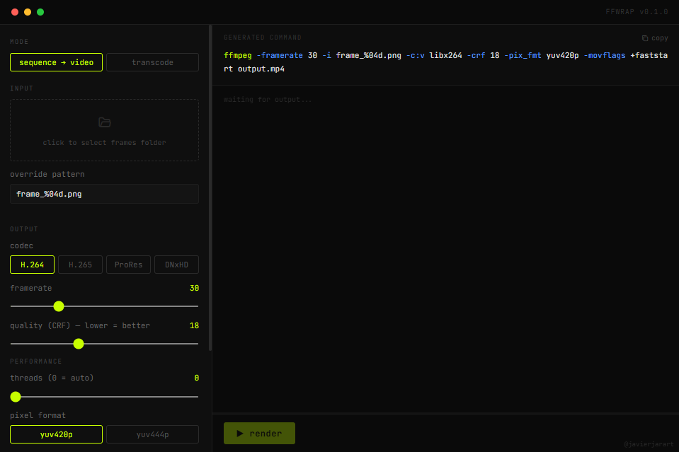

# FFwrap

  <b>GUI wrapper de FFmpeg</b> — convierte secuencias de imágenes a video y transcodifica archivos.

  
  
  
  
  
  
  

## Descargar

Descarga el instalador desde [Releases](https://github.com/javierjarart/FFwrap/releases):
- **`.msi`** — Instalador de Windows
- **`.exe`** — Instalador NSIS (portable)

FFmpeg ya viene incluido — no necesitas instalarlo por separado.

---

## Cómo usar

### Secuencia de imágenes → video

1. Selecciona **sequence → video**
2. Elige la carpeta con tus frames (PNG, EXR, TIFF, TGA)
3. Ajusta framerate, codec, calidad y formato de píxel
4. Opcional: elige carpeta de salida con **Browse** y limita el uso de CPU con el slider **threads**
5. Presiona **Render**

### Transcodificar video

1. Selecciona **transcode**
2. Elige el archivo de video
3. Cambia codec, calidad, recorta con trim in/out
4. Presiona **Render**

---

## Features

- **Sequence → video**: PNG / EXR / TIFF / TGA → MP4, MOV, MXF
- **Transcode**: cambiar codec, calidad (CRF), píxel format, recortar
- **Detección automática** del patrón de frames (`frame_%04d.png`)
- **Selector de carpeta de salida** — elige dónde guardar el resultado
- **Control de hilos** — limita el uso de CPU durante el render
- **Prioridad baja** automática — FFmpeg se ejecuta en idle/low priority para no saturar el PC
- **Preview del comando** FFmpeg en tiempo real
- **Barra de progreso** con porcentaje, frames, fps y velocidad
- **Log** con colores por nivel (info, warn, error)
- **FFmpeg bundleado** — no requiere instalación en el sistema

## Codecs soportados

| Codec  | Contenedor | Notas                        |
|--------|-----------|------------------------------|
| H.264  | .mp4      | CRF 0–51, yuv420p por defecto |
| H.265  | .mp4      | CRF 0–51, soporte 10-bit     |
| ProRes | .mov      | Profile 422 HQ, macOS-friendly|
| DNxHD  | .mxf      | Avid-compatible               |

## Atajos

- **Render**: Inicia o cancela el proceso
- **Browse** (en output): abre el diálogo Guardar como para elegir carpeta y nombre
- **Threads**: 0 = automático (usa todos los núcleos), 1–16 = limitar uso de CPU
